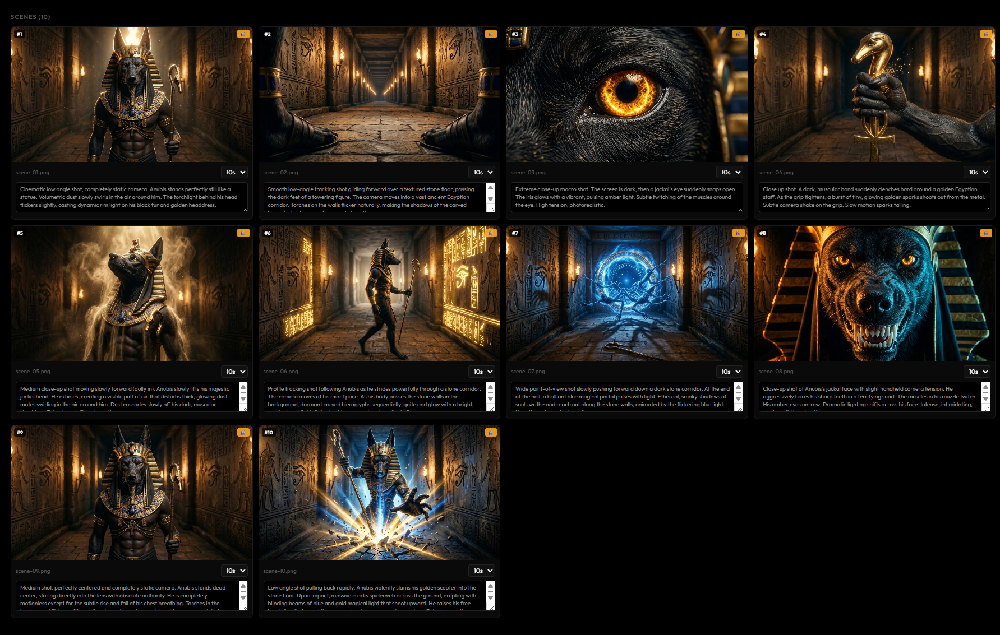
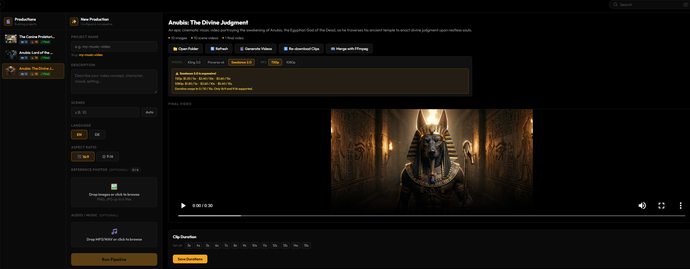

# CineFlow Studio

**AI-powered cinematic video production — from story to final cut, scene by scene.**

## Screenshots





CineFlow Studio is a standalone Node.js application that turns a written concept into a full video production. It generates a scene-by-scene script using Gemini AI, creates images for each scene, lets you generate videos via WaveSpeed (Kling, Pixverse, or Seedance), and merges everything into a final video with FFmpeg.

---

## Features

- **Story → Scenes** — Describe your concept, set a scene count (up to 100), and Gemini generates a full structured script
- **AI Image Generation** — Each scene gets a cinematic still generated via Gemini 3.1 Flash Image
- **Reference Photo Support** — Upload up to 6 reference images (characters, locations, style) to keep visual consistency
- **3 Video Models** via WaveSpeed API:
  - **Kling 3.0** — standard cinematic motion
  - **Pixverse v6** — flexible duration (1–15s), optional AI audio, 720p / 1080p
  - **Seedance 2.0** — Hollywood-grade quality, director-level camera control (5 / 10 / 15s only)
- **Editable Video Prompts** — Every scene shows its video prompt inline; edit and save without touching any files
- **Per-Scene Controls** — Regenerate image or video individually, set clip duration per scene
- **FFmpeg Merge** — Combine all scene clips into a final video with an optional audio track
- **Project Management** — Multiple projects, hide completed ones to keep the sidebar clean

---

## Video Model Pricing (WaveSpeed)

| Model | 720p | 1080p |
|-------|------|-------|
| Kling 3.0 | — | — |
| Pixverse v6 | per request | per request |
| **Seedance 2.0** | $1.20 / 5s · $2.40 / 10s · $3.60 / 15s | $1.80 / 5s · $3.60 / 10s · $5.40 / 15s |

> Seedance 2.0 only supports durations of **5, 10, or 15 seconds** and aspect ratios **16:9** and **9:16**. The app auto-snaps durations accordingly.

---

## Requirements

- **Node.js 18+**
- **FFmpeg** (for final video merge) — must be in your PATH
- API keys:
  - [`WAVESPEED_API_KEY`](https://wavespeed.ai/?ref=krzysztof) — for image editing + video generation
  - [`GEMINI_API_KEY`](https://aistudio.google.com) — for script generation + image generation

---

## Setup

```bash
# 1. Clone the repo
git clone https://github.com/MediaAI-AT/cineflow-studio-standalone.git
cd cineflow-studio-standalone

# 2. Install dependencies
npm install

# 3. Create your .env file
cp .env.example .env
# Then add your API keys to .env:
#   WAVESPEED_API_KEY=your_key_here
#   GEMINI_API_KEY=your_key_here

# 4. Start the server
npm start
```

Then open **http://localhost:3030** in your browser.

---

## .env File

```
WAVESPEED_API_KEY=your_wavespeed_key
GEMINI_API_KEY=your_gemini_key
```

---

## Workflow

```
1. New Production
   → Enter project name, story description, scene count, language, aspect ratio
   → Upload optional reference photos and/or audio track
   → Click "Run Pipeline"

2. Script & Images generated automatically
   → Gemini writes scene descriptions and image/video prompts
   → Images are generated scene by scene

3. Review & Edit
   → Open your project from the sidebar
   → Edit video prompts inline per scene
   → Regenerate any image or video individually

4. Generate Videos
   → Choose model: Kling 3.0 / Pixverse v6 / Seedance 2.0
   → Set resolution and audio options
   → Click "Generate Videos" — all scenes are submitted in parallel

5. Merge
   → Click "Merge with FFmpeg" to combine clips into a final video
```

---

## Project Structure

```
cineflow-standalone/
├── server.js              # Express-like HTTP server (no framework)
├── package.json
├── .env                   # API keys (not committed)
├── input/
│   ├── audio/             # Uploaded audio tracks
│   └── refs/              # Uploaded reference images
├── projects/
│   └── {project-slug}/
│       ├── production.json        # Script, scenes, prompts
│       ├── scene-durations.json   # Per-clip duration settings
│       ├── wavespeed-tasks.json   # Task IDs for re-downloading
│       ├── scenes/                # Generated images + videos
│       └── output/                # Final merged video
└── cineflow-studio/
    └── index.html         # Single-file frontend UI
```

---

## API Keys

| Key | Where to get it |
|-----|----------------|
| `WAVESPEED_API_KEY` | [wavespeed.ai](https://wavespeed.ai/?ref=krzysztof) |
| `GEMINI_API_KEY` | [aistudio.google.com](https://aistudio.google.com) |

---

## Changelog

| Version | What's new |
|---------|-----------|
| v1.4.0 | Seedance 2.0 model + cost warning |
| v1.3.0 | Editable video prompts per scene |
| v1.2.0 | Pixverse v6 model, audio toggle, resolution picker, project hide |
| v1.1.0 | Aspect ratio selector, scene regenerate buttons, auto-refresh |
| v1.0.0 | Initial release |

---

## License

MIT

---

If you find this project useful, a ⭐ on GitHub would mean a lot — thank you!
